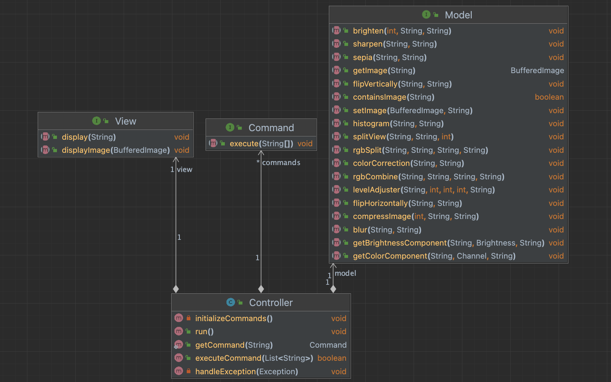
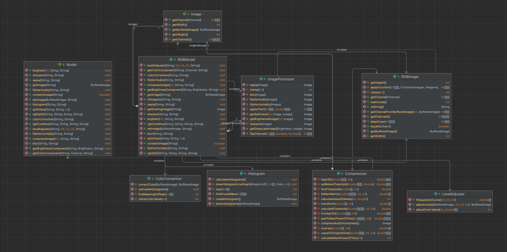
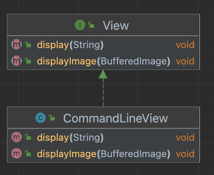
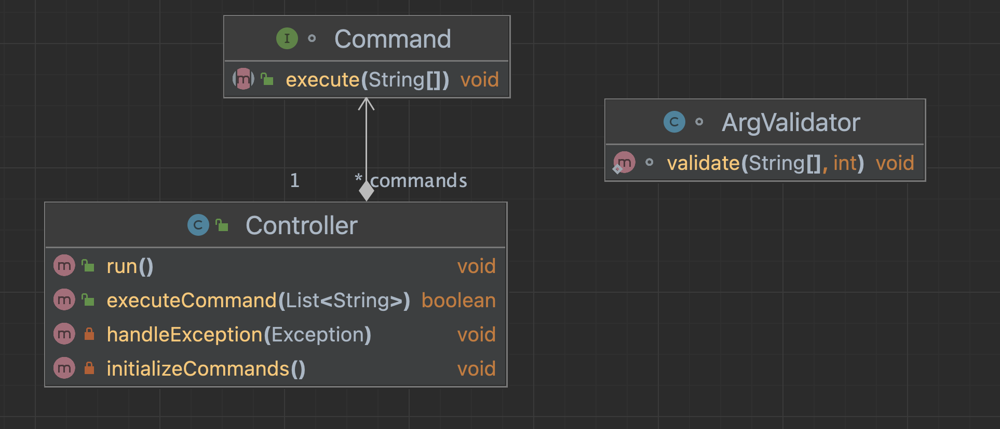

# MIME

This is a project for the course CS 5010: Program Design Paradigms at Northeastern University.

## Project Description

This project is a command-line image processing program. It will read in an image from a file, perform some operations on it, and write the result to another file.
Please see the [USEME.md](USEME.md) file for a detailed description of the program.
This program also supports reading from scripts containing a sequence of commands, and writing the results to files. The program will also support conventional file formats.

## How to run

### Prerequisites

- Java 11
- JUnit 4.x

### Running the program


#### Using the jar file

move `res/mime.jar` to the root directory of the project.
delete all the contents of the `res` directory except the `script.txt` file.
this is necessary because the images that are going to be created are already present in the `res` directory.
if you do not delete the contents of the `res` directory, the program will not be able to create the images.
then, run the following command from the root directory of the project.

```bash
java -jar mime.jar -file res/script.txt
```

#### Command-line view

- Clone the repository
- Navigate to the root/src/ime directory
- Run the Main class
- When prompted, either enter

```bash
run-script <script-file-path>
```
or enter commands manually.
```
load <image-file-path> <image-name>
```


When you are done, enter
```
quit
```
to exit the program.

**NOTE**: 
- images are saved in the root/resources directory. New will not be saved if the image name 
already exists. Delete the image from the resources directory if you want to save a new image with the same name.
- The new functionalities added in this assignment are in the `res/script.txt` directory.
- The commands from the previous assignment is in the `script-ime.txt` file in the root directory. 
  You can use this file to test the program.


## Overview of the code

`ime` package contains the entire source code for the program. The `ime` package contains the following sub-packages:
model, CLIController, view.

This the high-level architecture diagram for the program:


### Model
The model is responsible for the data and the logic of the program.




### View
There are two views in the program: the command-line view and the script view. The command-line view is the default view. The script view is used when the user enters the `run-script` command.



### Controller

The CLIController is responsible for the communication between the model and the view. It is also responsible for the execution of the commands.



Every command is a class that implements the `Command` interface. The `Command` interface has a single method `execute()`. The `execute()` method is called by the CLIController when the user enters a command. The `execute()` method is responsible for executing the command and returning the result to the CLIController.


## Resource used
The image used in the program is a picture from Unsplash by photographer [Petr Slováček](https://unsplash.com/@grwood).

The link to the image is [here](https://unsplash.com/photos/a-lighthouse-on-top-of-a-hill-near-the-ocean-YrQuagwtEbM).

Under the Unsplash License, the image is free to use for any purpose.


## Design changes and justifications

- Pixel wise operations are replaced with channel wise operations.

The original implementation of the program had pixel wise operations. This meant that the program had to iterate over every pixel in the image to perform the operation.
This was inefficient. The new implementation has channel wise operations. This means that the program iterates over every channel in the image to perform the operation. 
The need for this change was clear from the new extensions that were needed. This would enable 
us to handle channels more efficiently. For example, if we want to create an image that 
visualizes the red component of an image, we can simply copy the red channel of the original 
image to the new image. Also, if we ever need to access the pixel values, we can simply access 
it from the channel.

- Separation of concerns

As a result of the change from pixel wise operations to channel wise operations, the RGBImage class
became simpler. It is now responsible for only storing the image data. And the manipulation of the
image is done by RGBModel class and other classes like ImageProcessors. This separation of concerns
makes the code more modular and easier to maintain.

- Eliminating redundant code

I previously had an ImageManipulator class that was responsible for manipulating the image. It 
was redundant because the Image class already had methods to manipulate the image. So, I eliminated
this by combining the ImageManipulator class with the Image FileManager class.

- Integrate enums into the model interface

The Model interface now has enums which are used to represent the different types of brightness 
and color channels. This lets the CLIController and the view know what type of brightness or color
channel are available.

- Fixing design issues

I previously was managing the files in the FileManager class. This was a design issue because
Controller was responsible for managing the files. So, I moved the file management to the Controller
class.

- Adding new features

As this new assignment's feature extensions were standalone and required multiple helper methods,
I created a new class for each of the features. This made the code more modular and easier to 
maintain requiring less changes to the existing code.

## Parts of the program that are not complete

Everything is complete.
